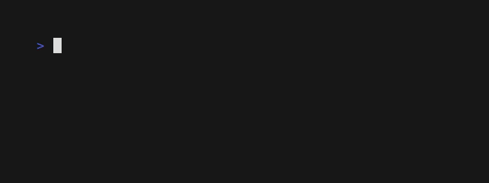

<h1 align="center">
    Exercícios
</h1>

<p align="center">:books: <em>Para iniciantes</em> :heavy_check_mark:</p>

<!--toc:start-->

- [Introdução](#introdução)
- [Exercicios](#exercicios)
    - [Fatorial](#fatorial)
    - [Pirâmide esquerda](#piramide-esquerda)
    - [Pirâmide direita](#piramide-direita)
    - [Pirâmide centro](#piramide-centro)
    - [Numeros primos](#numeros-primos)
    - [Contador de dígitos](#contador-de-digitos)
    - [Calculadora](#calculadora)
- [Fontes](#fontes)

<!--toc:end-->

## Introdução

Este repositório contem exercícios simples para iniciantes em programação que estão aprendendo como escrever algoritmos.
Foram selecionados exercícios que não dependem de conhecimentos em estrutura de dados, e que podem ser resolvidos apenas usando estruturas condicionais, laços de repetição e outros recursos básicos da linguagem sendo estudada.

Meu intuíto é ajudar pessoas que estão começando a aprender programação e que tem alguma dificuldade com o inglês, por isso traduzi, selecionei e adaptei os exercícios para o português. Vale notar
que fiz isso dentro dos limites do que foi ensinado até o dado momento no Bootcamp CDB, afím de ajudar meus colegas que estão começando. 

**Esteja ciente de que esta lista não é completa, e não passou pela aprovação dos organizadores do Bootcamp.**
Esta lista deve apenas servir como apoio e conteúdo extra para aqueles que querem testar seus conhecimentos e treinar um pouco de raciocínio lógico.

## Exercicios

A imagem na parte de baixo do exercício se trata de uma implementação exemplo para que o aluno possa ter uma noção de como o usuário deve interagir com o programa.

### Fatorial

Na matemática, o fatorial de um número natural N, é denotado por N!. Ou seja Fatorial de 5 pode ser escrito como 5! ou de 3 como 3! e etc.
O fatorial de um numero é o produto (multiplicação) de todos os numeros menores ou iguais a ele. Sendo assim o fatorial de 5 é igual á: `5 x 4 x 3 x 2 x 1 = 120`. O fatorial dos numeros 1 e 0 são 1.

Escreva um programa que receba um número (apenas o número), calcule seu fatorial, e depois mostre a equação que levou ao resultado. Por exemplo: 
- 0! = `0 = 1`
- 1! = `1 = 1`
- 3! = `3 * 2 * 1 = 6`
- 5! = `5 x 4 x 3 x 2 x 1 = 120`
- 8! = `8 * 7 * 6 * 5 * 4 * 3 * 2 * 1 = 40320`
- 10! = `10 * 9 * 8 * 7 * 6 * 5 * 4 * 3 * 2 * 1 = 3628800`


### Piramide esquerda

Neste exercício basta imprimir uma pirâmide alinhada á esquerda de acordo com o tamanho especificado pelo usuário. A pirâmide deve ter a altura 
e largura de acordo com o `número` inserido pelo usuário. Por exemplo:

- Entrada = 3
```
    *
    **
    ***
```
- Entrada = 6
```
    *
    **
    ***
    ****
    *****
    ******
```


### Piramide direita

Neste exercício basta imprimir uma pirâmide alinhada á direita de acordo com o tamanho especificado pelo usuário. A pirâmide deve ter a altura 
e largura de acordo com o `número` inserido pelo usuário. Por exemplo:

- Entrada = 3
```
      *
     **
    ***
```
- Entrada = 6
```
         *
        **
       ***
      ****
     *****
    ******
```


### Piramide centro

A pirâmide alinhada no centro é um pouco diferente, o `número` que o usuário insere apenas controla a altura da pirâmide. A pirâmide gerada deve ser
simétrica. Por exemplo:

- Entrada = 2
```
     *
    ***
```
- Entrada = 3
```
      *
     ***
    *****
```
- Entrada = 5
```
        *
       ***
      *****
     *******
    *********
```


### Numeros primos

Pode ser considerado primo um número natural que só é divisível por ele mesmo e por 1. Ou então, pode se dizer que número primo é um número natural `maior que 1` que não pode ser formado pela multiplicação de outros dois naturais `menores`.
Neste exercício deve ser escrito um programa que verifica se o número informado pelo usuário é primo ou não.

- Entrada = 2  -> Saída = `É primo.`
- Entrada = 3  -> Saída = `É primo.`
- Entrada = 4  -> Saída = `Não é primo.`
- Entrada = 17 -> Saída =  `É primo.`
- Entrada = 18 -> Saída =  `Não é primo.`
- Entrada = 16 -> Saída =  `Não é primo.`
- Entrada = 19 -> Saída =  `É primo.`
- Entrada = 69 -> Saída =  `Não é primo.`
- Entrada = 79 -> Saída =  `É primo.`


### Contador de digitos

Escreva um programa que deve realizar a contagem de quantos dígitos o número informado pelo usuário possui. Caso o número 0 seja inserido a saída esperada é 1.
Devem apenas ser considerados válidos números positivos, caso um número negativo seja inserido a mensagem de erro `"Número inválido. A entrada deve ser maior ou igual a 0."` deve ser mostrada.

- O número `0` tem 1 dígitos
- O número `1` tem 1 dígitos
- O número `2` tem 1 dígitos
- O número `3` tem 1 dígitos
- O número `10` tem 2 dígitos
- O número `100` tem 3 dígitos
- O número `239` tem 3 dígitos
- O número `509` tem 3 dígitos
- O número `1293` tem 4 dígitos
- O número `39482` tem 5 dígitos


### Calculadora

Crie uma calculadora básica capaz de realizar as 4 operações. Ao executar o programa o usuário deve selecionar a operação matemática a ser feita para depois inserir dois números que serão usados na operação.
Por fim o resultado deve ser mostrado ao usuário mostrando os números usados como entrada.

No exemplo a seguir a operação é selecionada pelo seu índice na lista. No momento de inserir os dois números para o cálculo, a operação escolhida é exibida entre parênteses.
```
escreva("---------------------\n")
escreva("[1] Soma\n")
escreva("[2] Subtração\n")
escreva("[3] Multiplicação\n")
escreva("[4] Divisão\n")
escreva("---------------------\n")
```



## Fontes

Eu não sou o autor/criador dos exercícios dispostos nesse repositório, as fontes originais do material (em inglês) estão disponíveis abaixo para quem quiser ver.

- https://pwskills.com/blog/basic-programming-problems/
- https://www.masterycoding.com/blog/5-coding-challenges
- https://adriann.github.io/programming_problems.html
- https://www.coodemaroc.com/p/algo.html
